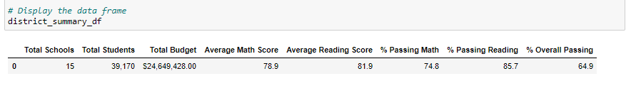
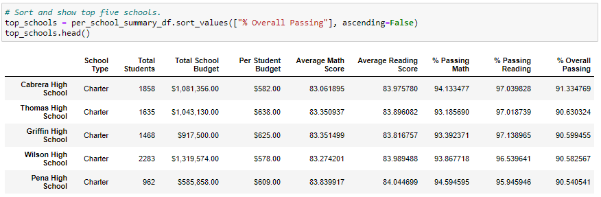
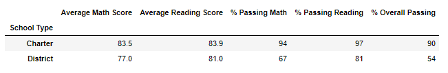

# School_District_Analysis
Analysis using Python

## Overview of Project
**Analyze school disctrict data on student funding and student standardized test scores to show trends and schools performance. The analysis and findings will be used by the school board to make strategic decisions regarding the school budget and priorities**

**The Analysis should include the following information:** 

1. Perform data cleaning to exclude reading and math grades for Thomas High School ninth graders due to possible academic dishonesty (records appear to have been altered)
2. A High-level snapshot of the district's key metrics, presented in a table format 
3. An overview of the key metrics for each school, presented in a table format

**The analysis report will include tables presenting each of the following metrics:**

- Top 5 and bottom 5 performing schools, based on the overall passing rate
- The average math score received by students in each grade level at each school
- The average reading score received by students in each grade level at each school
- School performance based on the budget per student
- School performance based on the school size 
- School performance based on the type of school

## Resources
- Data Source: [schools_complete.csv](Resources/schools_complete.csv); [students_complete.csv](Resources/students_complete.csv)
- Source Code: [PyCitySchools_Challenge](PyCitySchools_Challenge.ipynb)
- Software: Python 3.7.9 64-bit (conda); jupyter-notebook : 6.1.4

## Summary
- #### *Note: Updated data analysis was performed on cleaned data set (reading and math grades for Thomas High School ninth graders were replaced with NaNs to account for data issues and excluded from aggregate calculations)*

- Code Example:

        # Step 2. Use the loc method on the student_data_df to select all the reading scores from the 9th grade at Thomas High School and replace them with NaN.
        student_data_df.loc[(student_data_df["grade"]=="9th")&(student_data_df["school_name"]=="Thomas High School"),"reading_score"]=np.nan
        student_data_df
        

- **The district summary DataFrame**

- **The school summary DataFrame**

- **The top 5 performing schools, based on the overall passing rate**

- **The bottom 5 performing schools, based on the overall passing rate**

- **The average math score for each grade level from each school**

- **The average reading score for each grade level from each school**

- **The scores by school spending per student**

- **The scores by school size**

- **The scores by school type**

## Results
- *How is the district summary affected?*

   ***Original District Summary (before replacing 9th grade math and reading scores for Thomas High School with NaN values)***
   
   
   
   
   ***Updated District Summary (after replacing 9th grade math and reading scores for Thomas High School with NaN values)***
   
   

- *How is the school summary affected?*
   
   ***Original School Summary (before replacing 9th grade math and reading scores for Thomas High School with NaN values)***
   
   
   
   
   ***Updated School Summary (after replacing 9th grade math and reading scores for Thomas High School with NaN values)***
   
   
   
- *How does replacing the ninth graders’ math and reading scores affect Thomas High School’s performance relative to the other schools?*
   - The overall school performance % decreases by less than 0.5% (from 90.95% to 90.63%) 
   - Even though the overall performance % decreases by less than 0.5%, it does not have any affect on the school's position in the top 5 high performing schools
   - Thomas High School remains the 2nd top performing school
   
   

- **How does replacing the ninth-grade scores affect the following:**

- *Math and reading scores by grade*
   - Only grades for 9th grade for Thomas High School are affected and not available in updated dataset. Other math and reading scores are not affected for Thomas High School or any other school.
   
- *Scores by school spending*
   - No changes have been detected to any metrics under **$630-644** school spending category (Thomas High School falls in this category).
   
- *Scores by school size*
   - No changes have been detected to any metrics under **Medium(1000-2000)** school size category (Thomas High School falls in this category).
   
- *Scores by school type*
   - No changes have been detected to any metrics under **Charter** school category (Thomas High School falls in this category).
    
### School District Data Analysis Summary:
The four major changes in the updated school district analysis after reading and math scores for the ninth grade at Thomas High School have been replaced with NaNs.

